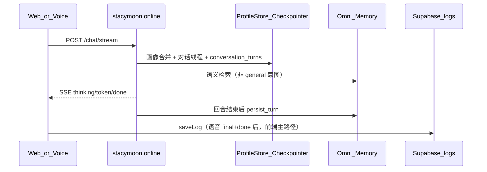

# StacyMoon Agent — API 契约

> **版本** 1.0 · **Agent 仓库** `stacy-moon-agent`  
> **生产 Base URL** `https://stacymoon.online`  
> **Web 客户端** [gmchenn-sys/stacymoon](https://github.com/gmchenn-sys/stacymoon)  
> **最后更新** 2026-07-08

本文档描述 **StacyMoon 月亮守护者** 与 Agent 后端的接口约定。

| 角色 | 同学 | 职责 |
|------|------|------|
| 语音 | **Christine** | STT/TTS、通话管道、调 `/chat/stream`（`reply_mode=voice`） |
| 前端 | **高高** | Web UI、字幕面板、`saveLog`、聊天页历史 |
| Agent | 本仓库 | 文字理解、SSE 回复、服务端落库、history API |

RoarCycle 循练为独立产品，契约见 [`docs/roarcycle-subagent-design.md`](roarcycle-subagent-design.md)（自行维护，不在本文范围）。

语音字幕协作任务见 [`docs/VOICE_TRANSCRIPT_TODO.md`](VOICE_TRANSCRIPT_TODO.md)。

---

## 1. 架构总览



### Agent 行为（客户端需知晓）

| 模块 | 作用 | 客户端影响 |
|------|------|------------|
| **意图路由** | `crisis` 固定回复；`health_knowledge` RAG；`emotional_support` 情绪模式；`general` 闲聊 | `done.intent` 可用于 UI 标签 |
| **ProfileStore** | 称呼、年龄、困扰等注入 prompt | **每轮传 `stacy_profile`**，避免叫错名字 |
| **Checkpointer** | 按 `user_id` 持久化 LLM 上下文 | `user_id` 必须跨会话稳定 |
| **conversation_turns** | 每轮 `done` 后写入 user+assistant | history API 对账/兜底；**不含 STT interim** |
| **Omni Memory** | 跨会话长期记忆（服务端配 Key 后启用） | 客户端无需传 history |
| **安全护栏** | 危机干预、医疗免责 | 危机时不调 LLM，直接返回固定文案 |

**流式说明：** `POST /chat/stream` 每轮只送**当前用户消息**给 LLM；连贯性依赖画像 + Omni Memory + 消息规则提取，不依赖客户端拼 history。

---

## 2. 端点一览

| 方法 | 路径 | 用途 | 推荐 |
|------|------|------|------|
| `GET` | `/health` | 探活 | — |
| `POST` | **`/chat/stream`** | **主入口** — SSE 流式（文字 + 语音） | ✅ |
| `POST` | **`/v1/agent/chat/stream`** | 统一 SSE（等同 `/chat/stream`，需 `sub_agent=stacymoon`） | 可选 |
| `GET` | **`/v1/conversations/{user_id}/messages`** | 对话历史（对账/兜底） | 语音 Phase 2 |
| `POST` | `/chat` | 同步单轮（经 Cloudflare 代理） | legacy |
| `POST` | `/chat/sync` | 同步单轮（调试） | — |
| `POST` | `/v1/agent/chat` | 同步单轮（`sub_agent=stacymoon`） | — |
| `POST` | `/v1/chat/completions` | OpenAI 兼容 | legacy，不推荐新接 |
| `POST` | `/beta/activate` | MOON 内测码激活 | MOON 码 |
| `POST` | `/beta/register` | 邀请码登记 Agent | Supabase 验证后 |
| `GET` | `/v1/models` | OpenAI 模型列表 | — |

**Web 代理（StacyMoon 仓库）：**

| 前端路径 | 转发目标 |
|----------|----------|
| `POST /api/chat` | `https://stacymoon.online/chat` |

目标：文字聊天改代理至 **`/chat/stream`**，并透传 `stacy_profile`。

---

## 3. 主接口：`POST /chat/stream`

### 3.1 请求

```http
POST /chat/stream
Content-Type: application/json
```

**文字聊天：**

```json
{
  "message": "昨晚睡得不太好",
  "user_id": "invite_abc123",
  "reply_mode": "text",
  "channel": "text",
  "stacy_profile": {
    "name": "阿梅",
    "age": 48
  }
}
```

**语音通话（每轮 STT final 后）：**

```json
{
  "message": "昨晚又热醒了，一身汗",
  "user_id": "invite_abc123",
  "reply_mode": "voice",
  "channel": "voice",
  "call_id": "550e8400-e29b-41d4-a716-446655440000",
  "stacy_profile": { "name": "阿梅", "age": 48 }
}
```

| 字段 | 类型 | 必填 | 说明 |
|------|------|------|------|
| `message` | string | ✅ | 1–2000 字；语音传 **STT final**（不传 interim） |
| `user_id` | string | ✅ | 跨会话稳定；= `localStorage.stacy_invite_code` |
| `reply_mode` | `"text"` \| `"voice"` | 否 | 默认 `text`；语音传 `voice`（口语短句，适合 TTS） |
| `channel` | `"text"` \| `"voice"` | 否 | 默认 `text`；语音通话传 `voice` |
| `call_id` | string | 语音建议 | 同一次通话共用 UUID；文字不传 |
| `stacy_profile` | object | 强烈建议 | 每轮附带，见 §6 |

### 3.2 响应（SSE）

`Content-Type: text/event-stream`

```
data: {"type":"thinking"}

data: {"type":"evidence","status":"found","sources":["围绝经期知识库 · 潮热与盗汗"]}

data: {"type":"token","content":"阿梅"}

data: {"type":"token","content":"，"}

data: {"type":"done","response":"阿梅，听起来昨晚不太好…","intent":"emotional_support","user_id":"invite_abc123","reply_mode":"text","channel":"text","call_id":null,"sources":["围绝经期知识库 · 潮热与盗汗"]}
```

| event `type` | 字段 | 说明 |
|--------------|------|------|
| `thinking` | — | 预处理中，可显示「正在想…」 |
| `evidence` | `status`, `sources?` | RAG 状态；`health_knowledge` 意图时出现 |
| `token` | `content` | LLM 增量文本；语音侧同步送 TTS |
| `done` | `response`, `intent`, `user_id`, `reply_mode`, `channel`, `call_id`, `sources?` | 完整回复与元数据 |
| `error` | `detail` | 失败信息 |

**`reply_mode=voice`：** 纯口语中文，无 Markdown/emoji；`sources` 不进 TTS 正文，可单独 UI 展示。

**落库约定：**

- Agent：每轮 `done` 后写 `conversation_turns`（user + assistant）
- 前端：每轮 `done` 后 `saveLog` × 2（Supabase 主展示）
- **interim 不落库**，仅 STT final + Agent done

### 3.3 `intent` 枚举

| 值 | 含义 | Agent 行为 |
|----|------|------------|
| `general` | 闲聊 | 不查 Omni Memory |
| `health_knowledge` | 健康科普 | RAG + 长期记忆 |
| `emotional_support` | 情绪陪伴 | 情绪 prompt + 长期记忆 |
| `crisis` | 危机干预 | 固定安全回复 |

---

## 4. 对话历史：`GET /v1/conversations/{user_id}/messages`

供 **saveLog 对账 / Supabase 缺失时兜底**。

```http
GET /v1/conversations/invite_abc123/messages?limit=50&channel=voice&call_id=550e8400-e29b-41d4-a716-446655440000
```

| 参数 | 类型 | 默认 | 说明 |
|------|------|------|------|
| `limit` | int | 50 | 1–200 |
| `channel` | `"text"` \| `"voice"` | 不过滤 | |
| `call_id` | string | 不过滤 | 按单次语音通话筛选 |

**响应：**

```json
{
  "user_id": "invite_abc123",
  "messages": [
    {
      "role": "user",
      "content": "昨晚又热醒了",
      "channel": "voice",
      "call_id": "550e8400-e29b-41d4-a716-446655440000",
      "reply_mode": "voice",
      "intent": null,
      "created_at": "2026-07-08T03:21:00+00:00"
    },
    {
      "role": "assistant",
      "content": "听起来昨晚不太好…",
      "channel": "voice",
      "call_id": "550e8400-e29b-41d4-a716-446655440000",
      "reply_mode": "voice",
      "intent": "emotional_support",
      "created_at": "2026-07-08T03:21:02+00:00"
    }
  ]
}
```

---

## 5. 其他接口

### 5.1 `POST /v1/agent/chat/stream`

与 `/chat/stream` **SSE 格式相同**。请求体：

```json
{
  "sub_agent": "stacymoon",
  "message": "昨晚又热醒了",
  "user_id": "invite_abc123",
  "reply_mode": "voice",
  "channel": "voice",
  "call_id": "550e8400-e29b-41d4-a716-446655440000",
  "stacy_profile": { "name": "阿梅", "age": 48 }
}
```

### 5.2 `POST /chat` / `/chat/sync` / `/v1/agent/chat`

请求体字段同 §3.1。同步 JSON 响应：

```json
{
  "response": "月亮守护者的完整回复",
  "user_id": "invite_abc123",
  "intent": "health_knowledge",
  "reply_mode": "text"
}
```

`/v1/agent/chat` 额外回显 `sub_agent: "stacymoon"`。

### 5.3 `POST /v1/chat/completions`（legacy）

旧版 Pipecat 兼容。**新接入请用 `/chat/stream`。**

```json
{
  "model": "stacy-moon",
  "messages": [{"role": "user", "content": "你好"}],
  "stream": true,
  "user": "invite_abc123",
  "reply_mode": "voice",
  "channel": "voice",
  "call_id": "550e8400-e29b-41d4-a716-446655440000",
  "stacy_profile": {"name": "阿梅", "age": "48"}
}
```

| 字段 | 映射 |
|------|------|
| `user` | → `user_id` |
| 最后一条 `role=user` | → `message` |
| 其余 | 同 `/chat/stream` |

**限制：** OpenAI chunk **不含** `channel`/`call_id`；对账请用 `/chat/stream` 的 `done` 或 history API。

---

## 6. `stacy_profile`

### 6.1 前端建档结构（`localStorage.stacy_profile`）

```json
{
  "name": "阿梅",
  "age": "48",
  "height": "160",
  "weight": "55",
  "period_status": "irregular",
  "symptoms": ["hot_flash", "poor_sleep"],
  "exercise": "occasional",
  "exercise_type": "散步",
  "diet": "none",
  "medication": "钙片、维D"
}
```

### 6.2 Agent 已支持字段

| 字段 | 状态 | Agent 用法 |
|------|------|------------|
| `name` / `nickname` | ✅ | 注入 prompt「称呼：…」 |
| `age` | ✅ | 支持 string（`"48"`）或 number |
| `symptoms` / `exercise` / `medication` 等 | 🔜 | 目前从消息规则提取 |

### 6.3 前端推荐调用

```javascript
function getUserId() {
  return localStorage.getItem('stacy_invite_code') || 'anonymous';
}

function getStacyProfile() {
  try { return JSON.parse(localStorage.getItem('stacy_profile') || '{}'); }
  catch { return {}; }
}

const profile = getStacyProfile();
const res = await fetch('https://stacymoon.online/chat/stream', {
  method: 'POST',
  headers: { 'Content-Type': 'application/json' },
  body: JSON.stringify({
    message: userMessage,
    user_id: getUserId(),
    reply_mode: 'text',
    channel: 'text',
    stacy_profile: {
      name: profile.name || undefined,
      age: profile.age ? Number(profile.age) : undefined,
    },
  }),
});
// 解析 SSE：thinking → evidence? → token → done
```

---

## 7. `user_id` 与 Beta

**规则：`user_id` = 规范化邀请码 = `localStorage.stacy_invite_code`**

| 步骤 | 说明 |
|------|------|
| 1 | 前端 Supabase 验证邀请码（或 MOON 码走 `/beta/activate`） |
| 2 | `POST /beta/register` `{ "invite_code": "..." }` |
| 3 | 后续所有聊天请求传返回的 `user_id` |

```json
// POST /beta/register
{ "invite_code": "MyWeChat123", "role": "mother" }

// 响应
{
  "status": "registered",
  "user_id": "MyWeChat123",
  "invite_code": "MyWeChat123"
}
```

`BETA_GATE_ENABLED=true` 时，未注册 `user_id` 返回 403。

---

## 8. 记忆与存储分工

| 数据 | 存储 | 谁写 | 谁读 |
|------|------|------|------|
| 用户画像 | Agent SQLite | Agent（profile + 规则） | Agent prompt |
| LLM 对话上下文 | Agent Checkpointer | Agent 每轮 | Agent 内部 |
| 可读对话历史 | Agent `conversation_turns` | Agent 每轮 `done` | history API |
| 长期语义记忆 | Omni Memory | Agent 每轮 | Agent 检索 |
| 聊天 UI 记录 | Supabase `logs` | 前端 `saveLog` | 前端聊天页 |

**Supabase `saveLog` 建议字段（前端仓库扩展）：**

| 字段 | 说明 |
|------|------|
| `channel` | `"text"` \| `"voice"` |
| `call_id` | 语音 UUID；文字 null |
| `intent` | 来自 `done.intent`（assistant 条） |
| `sources` | 来自 `done.sources`（assistant 条） |

---

## 9. 错误响应

| HTTP | 场景 |
|------|------|
| 400 | 参数校验失败 |
| 403 | Beta Gate 未注册 |
| 500 | Agent 内部错误 |
| SSE `error` | 流式中途失败 |

---

## 10. 联调清单

### Agent（已实现）

- [x] `/chat/stream` + `stacy_profile`
- [x] `reply_mode` / `channel` / `call_id`
- [x] SSE `done` 回显完整元数据
- [x] history API
- [x] `/v1/agent/chat/stream`

### 高高（前端）

- [ ] 流式改走 `/chat/stream` + `stacy_profile`
- [ ] Cloudflare 代理透传 profile / 改指向 stream
- [ ] 语音：`channel` + `call_id`；`done` 后 saveLog × 2
- [ ] Supabase `logs` 扩展字段；聊天页合并 voice + text

### Christine（语音）

- [ ] 入口 `/chat/stream`（非 `/v1/chat/completions`）
- [ ] STT final 才调 Agent；token → TTS
- [ ] 每轮传 `reply_mode=voice`, `channel=voice`, `call_id`
- [ ] `done` 后通知高高 `onTurnComplete`（供 saveLog）

### 验收（效果）

- [ ] 建档后 Agent 叫对用户名
- [ ] 语音 3 轮 → 通话字幕完整
- [ ] 挂断 → 聊天页有记录；刷新仍在
- [ ] history API 与 Supabase 可对账

---

## 11. 路线图

| 优先级 | 项 |
|--------|-----|
| P0 | 语音字幕 + 双写落库（见 `VOICE_TRANSCRIPT_TODO.md`） |
| P0 | Web 改 `/chat/stream` + `stacy_profile` |
| P1 | Agent 接收建档 `symptoms` / `exercise` / `medication` |
| P2 | 环境传感器 `context`、IoT `action`/`card` |

---

## 附录：本地调试

```bash
uvicorn app.main:app --reload   # http://localhost:8000

# 文字
curl -N -X POST http://localhost:8000/chat/stream \
  -H 'Content-Type: application/json' \
  -d '{"message":"你好","user_id":"dev-001","stacy_profile":{"name":"阿梅","age":48}}'

# 语音
curl -N -X POST http://localhost:8000/chat/stream \
  -H 'Content-Type: application/json' \
  -d '{"message":"昨晚又热醒了","user_id":"dev-001","reply_mode":"voice","channel":"voice","call_id":"call-test-1","stacy_profile":{"name":"阿梅","age":48}}'

# 历史
curl -s "http://localhost:8000/v1/conversations/dev-001/messages?call_id=call-test-1"
```
