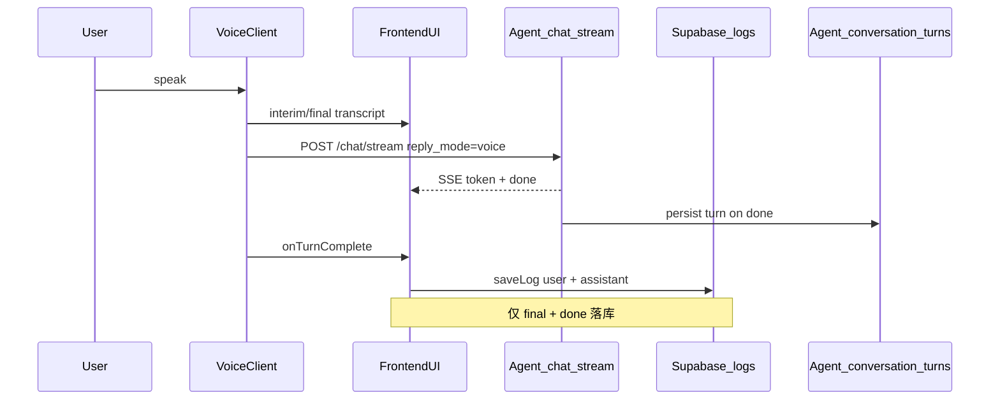

# 语音通话字幕 × 聊天历史 — 协作 Todo

> 目标：通话中能看到双向字幕（类似豆包），挂断后记录进入聊天历史。  
> 涉及方：**高高（前端 / StacyMoon Web）** · **Christine（语音 / Pipecat·SDK）** · **Agent 后端（本 repo）**

---

## 已锁定决策

| 决策 | 结论 |
|------|------|
| Agent 入口 | 统一 `POST /chat/stream`，语音传 `reply_mode=voice` |
| interim 落库 | **否** — 仅 STT **final** + Agent **done** 落库 |
| 落库责任 | **双写**：前端 `saveLog`（主，Supabase 展示）+ Agent `conversation_turns`（辅，history API 对账/兜底） |

### saveLog vs history API 的效果差别

| 方案 | 用户看到什么 | 局限 |
|------|-------------|------|
| 仅前端 saveLog | 挂断后聊天页有完整记录；刷新仍在 | 前端漏写/断线则 UI 无记录 |
| 仅 Agent history API | 前端可从 Agent 拉历史，不依赖 Supabase | 需前端接 API 才能展示 |
| **双写（本次）** | 聊天页以 Supabase 为主；缺失时可从 Agent 补全 | 实现稍多，最抗丢记录 |

Phase 2 验收以「前端 saveLog 后聊天页可见」为主；Agent history API 作为对账兜底，不要求语音客户端直接消费。

---

## 架构与数据流



---

## Phase 1 — 通话中实时字幕（P0）

### Christine（语音）

- [ ] STT 分 **interim** / **final** 两档事件
- [ ] STT **final** 后调 `POST /chat/stream`（带 `user_id`, `reply_mode=voice`, `stacy_profile`, `call_id`, `channel=voice`）
- [ ] 消费 SSE：`thinking` → `token` → `done`；`token` 同步送 TTS
- [ ] 暴露 `onTurnComplete` / `onCallStart` / `onCallEnd` 生命周期

### 高高（前端）

- [ ] 新增 **通话字幕面板** `VoiceCallTranscript`
- [ ] 用户 interim：灰色/半透明；final：正常样式
- [ ] Agent `token`：assistant 气泡逐字追加
- [ ] `call_id` 绑定同次通话所有 turn

### Phase 1 验收（效果）

打 3–5 轮语音，**全程可见 user + assistant 文字**，无需挂断。

---

## Phase 2 — 聊完有记录（P0）

### 高高（前端）— 主路径

- [ ] 每轮 `onTurnComplete` 后 **`saveLog` × 2**（user final + assistant `done.response`）
- [ ] 写入 `channel=voice`, `call_id`；可选 `intent` / `sources`
- [ ] 文字聊天页合并展示 voice + text；voice 加标记（如 🎙）
- [ ] 挂断后可跳转聊天页并定位本次 `call_id`

### Agent 侧（辅路径，本 repo）

- [x] 请求支持 `channel`（`text|voice`）、`call_id`
- [x] 每轮 `done` 后写入 SQLite `conversation_turns`（user + assistant 各一条）
- [x] `GET /v1/conversations/{user_id}/messages`（支持 `limit`, `channel`, `call_id` 过滤）
- [x] `POST /v1/agent/chat/stream`（stacymoon SSE，等同 `/chat/stream`）
- [x] SSE `done` 回显 `channel`, `call_id`

### Christine（语音）

- [ ] 保证 `onTurnComplete` 在 Agent `done` 之后、下一轮 STT 之前
- [ ] 断线时上报已完成的 turns

### Phase 2 验收（效果）

- 挂断 → 聊天页看到刚才全部回合；**刷新仍在**（Supabase）
- Agent `GET .../messages?call_id=xxx` 返回同内容（对账用）

---

## 接口约定（附录）

### 语音每轮请求

```http
POST /chat/stream
Content-Type: application/json
```

```json
{
  "message": "<STT final 文本>",
  "user_id": "<invite_code>",
  "reply_mode": "voice",
  "channel": "voice",
  "call_id": "<uuid>",
  "stacy_profile": { "name": "阿梅", "age": 48 }
}
```

### SSE 事件

| type | 说明 |
|------|------|
| `thinking` | 预处理中 |
| `token` | `{ "content": "..." }` 增量文本 |
| `done` | `{ "response", "intent", "user_id", "reply_mode", "channel", "call_id", "sources?" }` |
| `error` | `{ "detail" }` |

### 前端 saveLog（每轮 final + done 后各一条）

```json
{ "role": "user", "content": "<STT final>", "channel": "voice", "call_id": "<uuid>" }
```

```json
{ "role": "assistant", "content": "<done.response>", "channel": "voice", "call_id": "<uuid>", "intent": "emotional_support" }
```

**不写 interim。**

### Agent history API

```http
GET /v1/conversations/{user_id}/messages?limit=50&channel=voice&call_id=<uuid>
```

响应：

```json
{
  "user_id": "invite_abc123",
  "messages": [
    {
      "role": "user",
      "content": "昨晚又热醒了",
      "channel": "voice",
      "call_id": "550e8400-e29b-41d4-a716-446655440000",
      "reply_mode": "voice",
      "intent": null,
      "created_at": "2026-07-08T03:21:00+00:00"
    },
    {
      "role": "assistant",
      "content": "听起来昨晚不太好…",
      "channel": "voice",
      "call_id": "550e8400-e29b-41d4-a716-446655440000",
      "reply_mode": "voice",
      "intent": "emotional_support",
      "created_at": "2026-07-08T03:21:02+00:00"
    }
  ]
}
```

### 统一入口 `/v1/agent/chat/stream`（可选，等同 `/chat/stream`）

```http
POST /v1/agent/chat/stream
```

```json
{
  "sub_agent": "stacymoon",
  "message": "<STT final>",
  "user_id": "<invite_code>",
  "reply_mode": "voice",
  "channel": "voice",
  "call_id": "<uuid>",
  "stacy_profile": { "name": "阿梅", "age": 48 }
}
```

SSE 格式与 `/chat/stream` 相同。

---

## 联调 Checklist

- [ ] 同一 `user_id` 下语音能叫对名字
- [ ] 语音 3 轮 → 通话中字幕完整
- [ ] 挂断 → 聊天页有 6 条 log（3 user + 3 assistant）
- [ ] 刷新 / 重进 app → 记录仍在
- [ ] Agent `GET .../messages?call_id=xxx` 与 Supabase 内容一致

---

## API 契约调整清单

> 完整规格见 [`docs/API_CONTRACT.md`](API_CONTRACT.md)（v1.0，StacyMoon 专用）。以下为各端**必须改** vs **可选**。

### Agent 侧（本 repo，已实现）

| 项 | 状态 |
|----|------|
| `POST /chat/stream` 新增 `channel`、`call_id` | ✅ |
| SSE `done` 回显 `channel`、`call_id` | ✅ |
| `GET /v1/conversations/{user_id}/messages` | ✅ |
| `POST /v1/agent/chat/stream` | ✅ |
| `POST /v1/chat/completions` 兼容 `channel`、`call_id` | ✅（legacy，不推荐新接） |

### Christine（语音）— 需改

| 项 | 效果 | 优先级 |
|----|------|--------|
| Agent 入口改为 **`POST /chat/stream`** | 字幕、落库、多轮上下文一致 | P0 |
| 每轮传 `reply_mode=voice`, `channel=voice`, `call_id` | history API 可按通话筛选 | P0 |
| 仅 STT **final** 调 Agent | 避免 interim 污染对话 | P0 |
| 弃用 `/v1/chat/completions` 新接入 | OpenAI chunk 无 `channel`/`call_id`，对账困难 | P1 |

### 高高（前端）— 需改

| 项 | 效果 | 优先级 |
|----|------|--------|
| 文字聊天改走 `/chat/stream` + `stacy_profile` | 叫对名字、统一 SSE | P0 |
| Supabase `logs` 扩展 `channel`、`call_id` | 区分语音/文字、按通话聚合 | P0 |
| 语音每轮 `done` 后 `saveLog` × 2 | 挂断后聊天页有记录 | P0 |
| 聊天页合并展示 voice + text | 用户看到完整时间线 | P0 |
| 可选接 `GET .../messages` 对账 | Supabase 缺失时从 Agent 补全 | P1 |

### Supabase `logs` 表（前端仓库，契约扩展）

Agent 不写入 Supabase；前端 `saveLog` 需自行扩展字段（与 Agent history API 对齐）：

| 字段 | 类型 | 说明 |
|------|------|------|
| `channel` | `"text"` \| `"voice"` | 默认 `text` |
| `call_id` | string \| null | 语音通话 UUID；文字不传 |
| `intent` | string \| null | 来自 SSE `done.intent`（assistant 条） |
| `sources` | string[] \| null | 来自 SSE `done.sources`（assistant 条） |

**不写：** interim 临时字幕、STT 中间稿。

---

## 沟通约定

后续方案对齐以**可验收的用户效果**描述，不用排期或架构术语代替验收标准。
